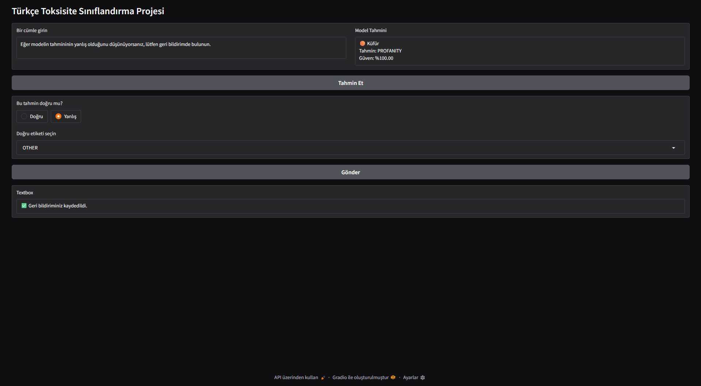

# Türkçe Toksik Metin Sınıflandırma Modeli

## Gradio Arayüzü

Modelin tahminlerini test edebileceğiniz etkileşimli bir arayüz geliştirilmiştir.  
Kullanıcılar tahminin doğruluğunu işaretleyip doğru etiketi belirterek geri bildirimde bulunabilirler.

**Not:** Bu görsel yalnızca arayüzü tanıtmak amaçlıdır; tahminin doğruluğu gerçek sonucu temsil etmeyebilir.

# Kullanılan Veri Seti:
- Overfit-GM/turkish-toxic-language veri seti temel alınmıştır.

# Model Özellikleri
- BiLSTM + CNN + Attention mimarisi
- Eğitimde FastText (cc.tr.300.vec) Türkçe vektörleri kullanılmıştır
